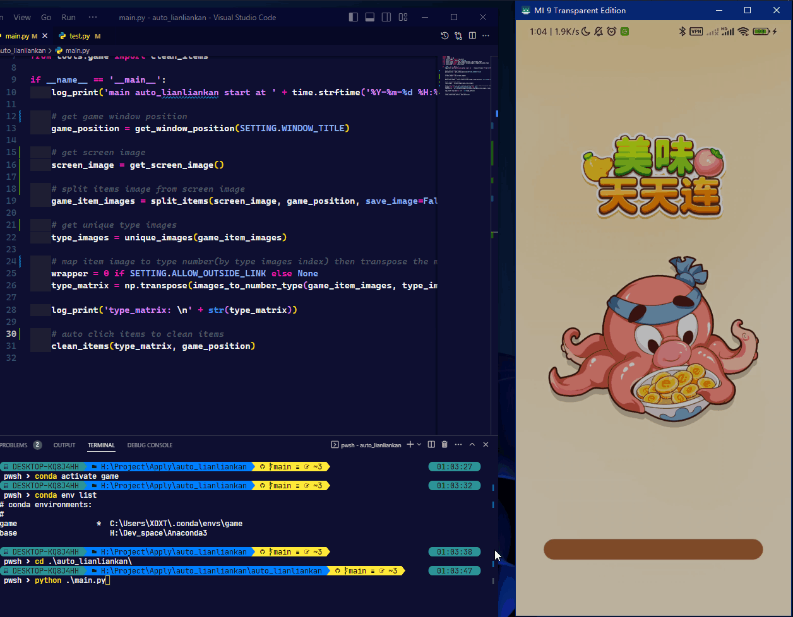
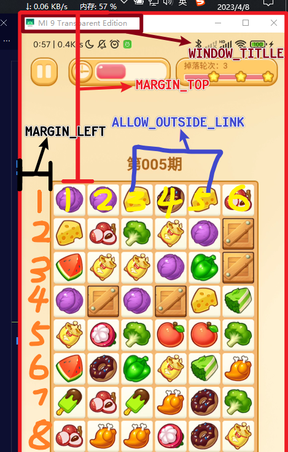
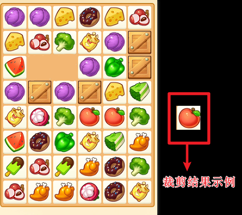

# 自动连连看辅助

本项目基于opencv 的 orb 图像相似度比较，实现了连连看自动消除，由程序识别相似方块，模拟鼠标点击。

示例基于 饿了么 美味天天连，测试手机通过 [scrcpy](https://github.com/Genymobile/scrcpy) 投屏到电脑




### 文件结构
```bash
auto_lianliankan
|-- assets
`-- main
    |-- config
    |-- data
    |-- log
    |-- temp
    `-- tools
```

**项目的主要代码文件夹为 `main/`**
- `config/` 中包含了配置文件 `setting.py`
- `logs/` 中包含了每次运行时的部分日志
- `data/` 中包含了自定义的空白方块和障碍物方块的图片样例
- `temp/` 中包含了每次运行时的截图和裁剪后的消除块图片

## 环境:

- python3.8+

## 安装:

```powershell
pip install -r requirements.txt
```

## 安装(Anconda):

```powershell
conda create -n game
conda activate game
pip install -r requirements.txt
```

## 使用

### 修改配置

> `main/config/setting.py`



```python
# 是否允许最外层的方块相连
ALLOW_OUTSIDE_LINK = True

# 游戏窗口标题，示例是 Scrcpy 连接的测试手机小米9 的窗口标题
WINDOW_TITLE = "MI 9 Transparent Edition"

# 方块点击后的停顿间隔
CLEAN_INTERVAL = 0.2

# 游戏内容区，距离游戏窗口边框左边的距离
MARGIN_LEFT = 56
# 游戏内容区，距离游戏窗口边框上边的距离，包括标题栏的长度
MARGIN_TOP = 244 + 28

# 水平的可相连消除块数量
HORIZONTAL_NUM = 6
# 垂直的可相连消除块数量
VERTICAL_NUM = 8

# 平均每个消除块的尺寸
ITEM_WIDTH = 55
ITEM_HEIGHT = 55

# 裁剪消除块，尽可能去除边框空白只留下图形
bx, by = 6, 6
# 以下为最终的消除快尺寸，无需改动 55-6 = 49x49
FINAL_WIDTH = ITEM_WIDTH - bx
FINAL_HEIGHT = ITEM_HEIGHT - by

# 消除后留下的空白图形，需要跟 FINAL_WIDTH，FINAL_HEIGH尺寸相同，本示例就是49x49大小的图片
EMPTY_IMAGE_PATH = ["data/empty1.png"]
# 无法被消除的障碍物方块图形，需要跟 FINAL_WIDTH，FINAL_HEIGH尺寸相同，本示例就是49x49大小的图片
BLOCK_IMAGE_PATH = ["data/block1.png"]

```

### 测试配置

**1. 执行代码，获得模拟数据** 
```powershell
cd Auto-Lianliankan/main/
python ./test.py
```

**2. 执行成功后，打开文件夹`Auto-Lianliankan/main/temp`**

  + 查看裁剪的消除块结果 `item_*.png`

  + 调整配置文件，运行`python ./test.py`，直至裁剪的消除块相对完成为止，最终标准可以参考图片
    

  + 查看终端输出/日志文件`Auto-Lianliankan/main/log`
    ```text
    # 可以找到类似字段的识别结果。
    # 0 表示空白方块，其余数字表示某种物品
    # 判断识别准确率，可以快速找几对同类型的物品，查看对应位置的数字是否相同
    [info] type_matrix: 
    [[ 0  0  0  0  0  0  0  0]
     [ 0  1  1  2  8  2  6  0]
     [ 0  2  6 10  4  1 37  0]
     [ 0  3  0  0  1 11 38  0]
     [ 0  1 35  1 36  2 13  0]
     [ 0  4  7 10 12 12 10  0]
     [ 0  3  8 11  4 13  9  0]
     [ 0  5  6  5  9  8 10  0]
     [ 0  6  9  9  7  8  4  0]
     [ 0  0  0  0  0  0  0  0]]
    ```

### 运行程序自动连连看

```powershell
cd Auto-Lianliankan/main/
python ./run.py
```

## 鸣谢

本项目使用了 python-opencv、pywin32 等开源代码库。感谢各位开源工作者的贡献！

## 声明

- 项目基于Apache License 2.0开源协议，使用请遵守协议规范

- 项目仅供学习交流使用，不对使用者的任何行为负责